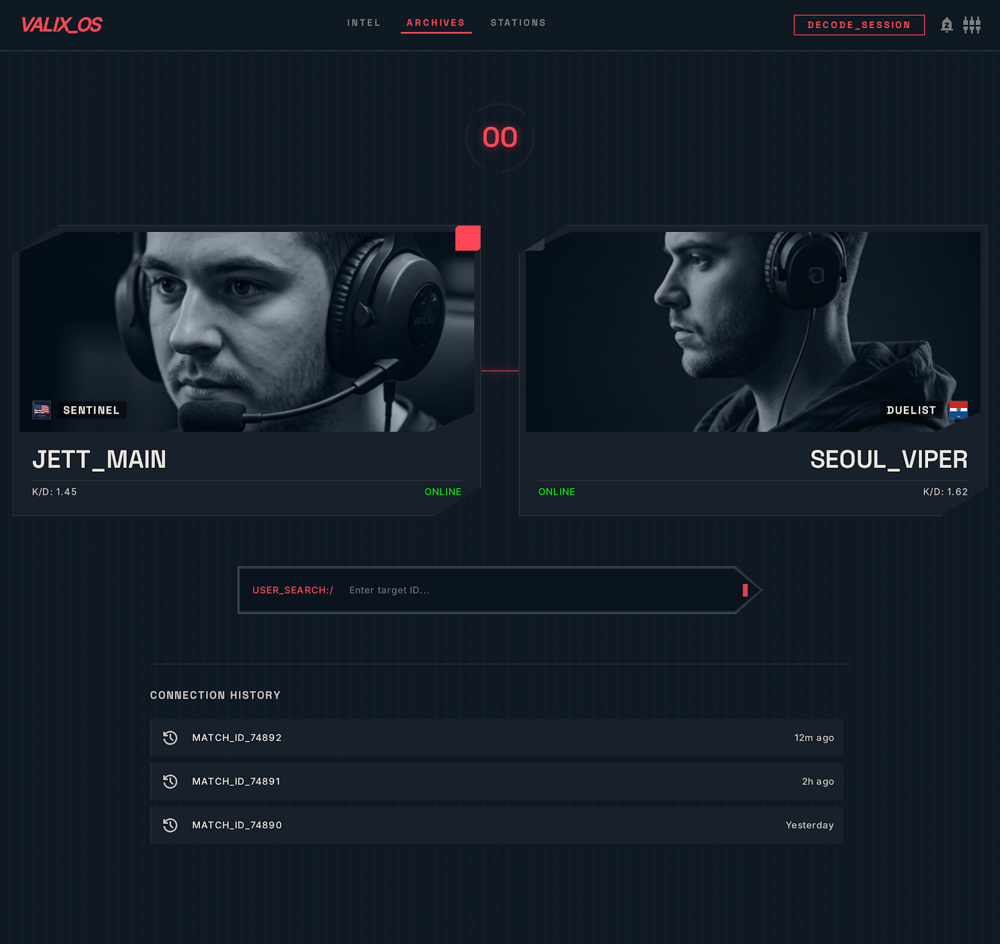
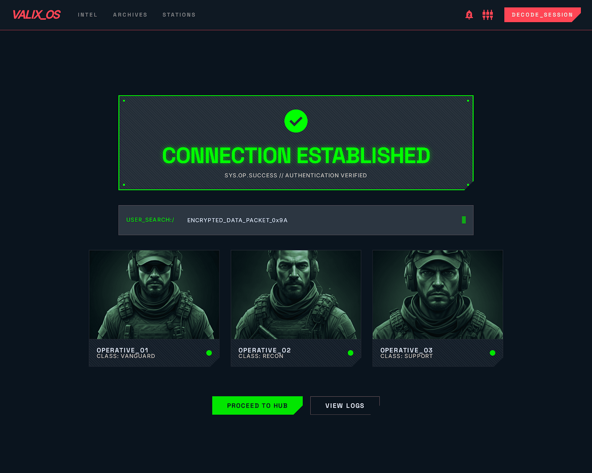
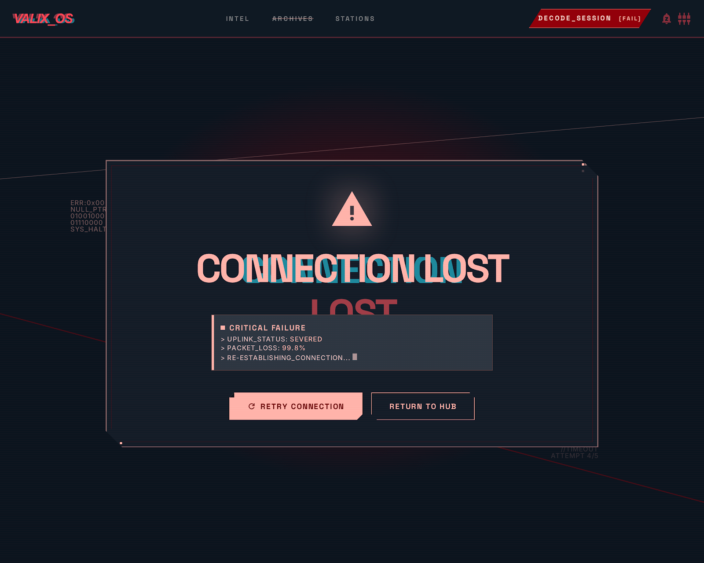

<div align="center">

# 🎮 VALIX.GG
**El juego definitivo de conexiones del ecosistema competitivo de Valorant**

[](https://github.com/Rubencalii/Juego_Valorant)
[](https://nextjs.org/)
[](https://tailwindcss.com/)
[](https://socket.io/)
[](https://supabase.com/)

[Explorar Documentación](./docs/01_README.md) · [Reportar Bug](https://github.com/Rubencalii/Juego_Valorant/issues) · [Solicitar Feature](https://github.com/Rubencalii/Juego_Valorant/issues)

</div>

<br />

## 🌟 ¿Qué es Valix.gg?

**Valix.gg** es un minijuego web de ritmo trepidante en el que pondrás a prueba tu conocimiento sobre los equipos y jugadores profesionales de Valorant. El objetivo es encadenar jugadores que hayan compartido equipo en algún momento de sus carreras, ¡todo esto contrarreloj con tan solo 15 segundos de margen!

Conecta jugadores correctos, acumula rachas, sobrevive a la presión y compite contra tus amigos o la comunidad global para demostrar quién sabe más del ecosistema VCT.

---

## 📸 Vistazo al Juego

| Pantalla Principal | Conexión Exitosa | Error / Tiempo Agotado |
| :---: | :---: | :---: |
|  |  |  |

---

## ✨ Características Destacadas

*   ⏱️ **Core Loop de 15 segundos:** Adrenalina pura. Cada conexión válida reinicia el reloj, pero un fallo te descuenta 5 segundos valiosos.
*   🧠 **Búsqueda y Autocompletado Inteligente:** Tolerancia a fallos, búsqueda difusa (fuzzy search) y soporte para alias históricos.
*   🔥 **Tres Modos de Juego Únicos:**
    *   🤖 **Entrenamiento:** Juega en solitario contra un bot implacable.
    *   🌍 **Cadena del Día (Daily Mode):** Todos los jugadores del mundo reciben el mismo desafío diario. ¿Quién logrará la cadena más larga?
    *   ⚔️ **PvP 1v1 y Matchmaking:** Desafía a un amigo por enlace privado o entra a la cola competitiva por ELO.
*   📱 **Diseño 100% Mobile-First:** Preparado para jugar desde el móvil con un teclado adaptado e interfaz reactiva de alto contraste.
*   🌐 **Internacionalizado (i18n):** Traducciones nativas en Español 🇪🇸, Inglés 🇬🇧 y Francés 🇫🇷.

---

## 🛠️ Stack Tecnológico

La arquitectura está diseñada en tres capas altamente desacopladas para garantizar el máximo rendimiento en el tiempo real:

| Frontend | Backend & Realtime | Base de Datos & ETL |
| :--- | :--- | :--- |
| **Framework:** Next.js 14 (App Router) <br/> **Estilos:** Tailwind CSS + UI Custom <br/> **Animaciones:** Framer Motion <br/> **Deploy:** Vercel | **Auth:** NextAuth.js (Google, Discord) <br/> **Sockets:** Node.js + Socket.io <br/> **API:** Next.js Serverless API <br/> **Deploy:** Railway | **Relacional:** PostgreSQL (Supabase) <br/> **Caché/Estado:** Redis (Upstash) <br/> **ETL/Scraping:** Python (Liquipedia API) |

> 📚 Puedes consultar los detalles profundos en el documento de [Arquitectura Técnica](./docs/03_Arquitectura_Tecnica.md).

---

## 🚀 Guía de Instalación (Desarrollo Local)

Sigue estos pasos para levantar el entorno completo de Valix en tu máquina local:

### 1. Clonar el repositorio
```bash
git clone https://github.com/Rubencalii/Juego_Valorant.git
cd Juego_Valorant
```

### 2. Instalar dependencias del Monorepo
```bash
npm install
```

### 3. Variables de Entorno
Copia el archivo de ejemplo y rellena las variables de Supabase, Redis y NextAuth:
```bash
cp .env.example .env.local
```

### 4. Configurar Base de Datos
Aplica las migraciones de Prisma para configurar tu base de datos:
```bash
npx prisma migrate dev
```

*(Opcional)* Llenar la base de datos con los scripts ETL en Python ubicados en `scripts/etl`.

### 5. Iniciar el Servidor de Desarrollo
```bash
npm run dev
```

📍 La aplicación estará disponible en `http://localhost:3000` y el servidor de sockets en `http://localhost:3001`.

---

## 🤝 Cómo Contribuir

¡Toda ayuda es bienvenida! Revisa nuestra [Guía de Contribución y Onboarding](./docs/05_Guia_Contribucion_Onboarding.md) para conocer nuestro flujo de ramas (git flow), las reglas de commits (conventional commits) y cómo estructurar tus Pull Requests.

---

## 📜 Licencia y Aviso Legal

Este es un proyecto Open Source creado por la comunidad y para la comunidad.

**Aviso:** Valix.gg es un proyecto no oficial de fans y no está afiliado ni patrocinado por Riot Games. Valorant y todos los activos asociados son marcas registradas de Riot Games, Inc. Los datos de los jugadores se obtienen respetando los términos de servicio de fuentes públicas como Liquipedia.

---
<div align="center">
  Hecho con ❤️ para la comunidad de Valorant
</div>
